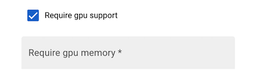
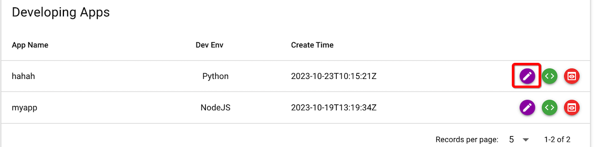
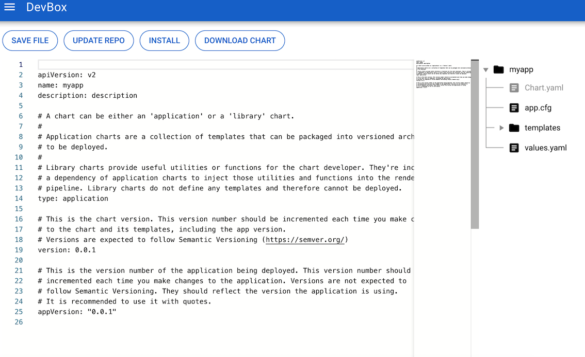
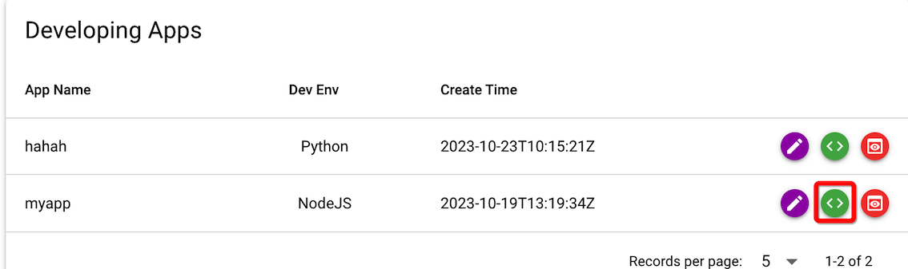
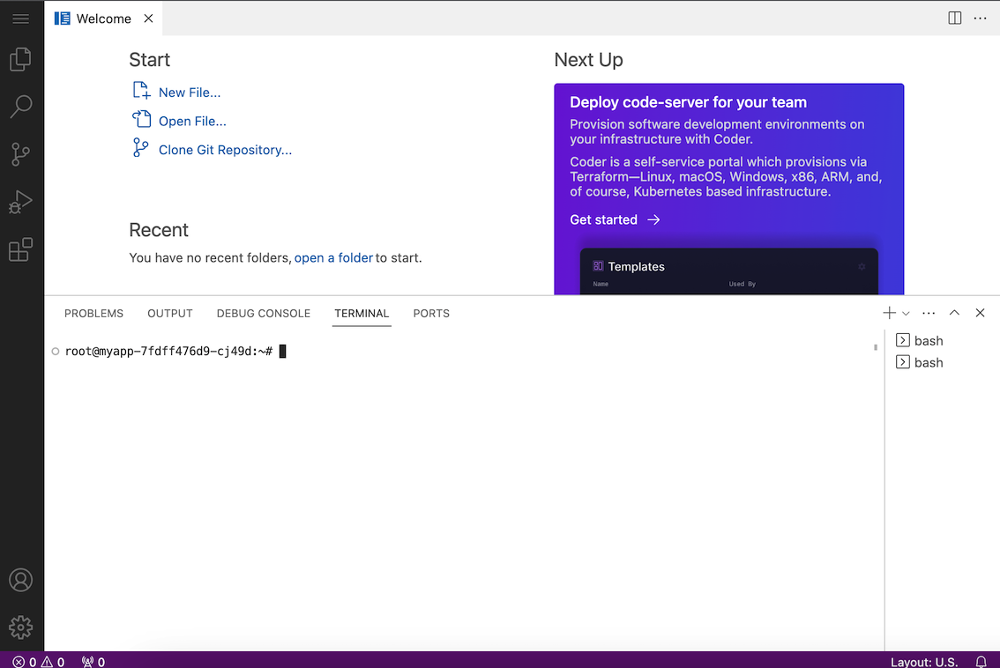
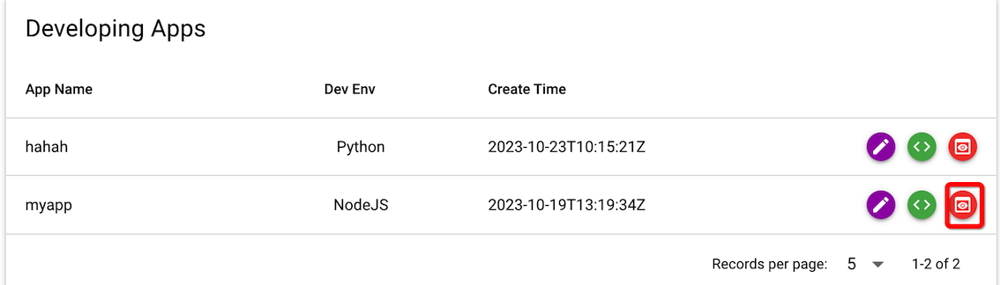

# 开始使用 DevBox

## 安装

1. 进入 Olares App Store
2. 找到 DevBox
3. 点击 Install
4. 等待安装完成后，即可点击 Open 打开 DevBox

## 创建 APP

1. 打开 DevBox， 从界面左边栏进入 Create APP 页面
2. 在右边主页面中输入要创建的 APP 的相关信息


- 输入你的 APP Name
- 选择你的 APP 所需要的开发语言 （ 系统会根据你的选择自动安装对应的开发容器 ）和 APP 相关的 Olares 系统相关设置

  - 目前支持三种语言 （ NodeJS、 Golang、 Python ）
  - 选择 “Require app data volume”, 会自动绑定 Olares 的 App Data 目录到容器中，以提供持久化的数据存储

  ```yaml
        volumes:
        - name: appcache
          hostPath:
            type: DirectoryOrCreate
            path: {{ .Values.userspace.appCache }}/<app name>
  ```

  - 选择 “Require user data volume”, 会自动绑定 Olares 用户数据存储目录到容器中，以方便 App 访问用户的个人数据

  ```yaml
        volumes:
        - name: userdata
          hostPath:
            type: DirectoryOrCreate
            path: {{ .Values.userspace.userData }}/<app name>
  ```

  - 选择 “Require gpu support”，并输入所需显存大小，系统会再安装时自动绑定 GPU 以供 APP 使用 （ 如果节点配置了 GPU 资源 ）

  

3. 设置完 APP 相关信息后，点击 “Submit” 创建 APP 对应的 Helm chart。
4. 成功创建后，自动进入开发中 APP 列表 （ Developing App ）

## 修改 Helm Chart

1. 在 Developing App 列表页面中，点击“Edit”按钮，可进入 APP 对应的 Helm Chart 操作页面



2. 进入 Edit 页面后可对 Chart 中的文件进行自定义修改



3. 如果修改 chart 相关文件以后，可点击 “SAVE FILE”，对修改进行保存。

## 安装仿真开发环境

1. 确认 chart 相关文件以后，可点击 "UPDATE REPO", 使 Helm Chart 生效。
2. Chart 生效之后，可点击 "INSTALL" 将开发 APP 的模拟环境安装到 Olares 中，以进行后续的仿真环境开发
3. 在开发过程中，如果需要对 Chart 相关文件进行调整修改，需要再次重复执行步骤 1 和 2

## 在仿真环境中开发

1. 开发容器安装到 Olares 中以后，可以在 Developing App 列表中进入开发环境 APP



2. 点击 "coding" 按钮后，即可进入仿真开发环境的 IDE 工具（ VS Code ），进入开发状态。



3. 在 IDE 中，可打开 Terminal 在容器中进行 git 操作 （ clone、pull、push ），以及开发相关的命令行操作。
4. 然后再 IDE 中，打开代码目录进行开发

## 调试预览

1. 在 Developing App 列表中进入调试预览 APP



2. 点击后会打开 开发中 APP 在 Olares 中的预览调试页面
3. 同时在 Olares 的桌面里也可以找到这个开发中的 APP，执行操作。
4. 在开发过程中，如需调试 APP，可在运行 debug 模式 APP 后，修改容器中 nginx 配置 （ /etc/nginx/conf.d/default.conf ）, 将对应的 location 转发到你的 APP


5. 修改配置文件后，在 Terminal 中执行

```bash
nginx -s reload
```

即可在 APP 预览模式窗口下，调试你的 APP

## 提交到应用商店

1. 在 APP 开发完成后，将你的 APP 镜像发布到公开的镜像仓库中
2. 在 APP 的编辑页面，点击 ”DOWNLOAD CHART“，下载 APP 的安装包
3. 将 Chart 包 Deployment.yaml 中的镜像修改为你之前发布的 APP 镜像
4. fork Olares 的应用商店 Github 仓库 ( https://github.com/beclab/apps )。
5. 提交你的 Chart 到代码仓库中。
6. 向 Olares 的 Github 仓库提交一个 Pull Request，并按照 PR 模版仔细填写内容
7. 等待 Olares 审核通过，并合并 PR 之后，你的 APP 则成功提交到 Olares 的应用商店中，可供其他用户安装使用。
